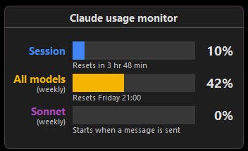

# CLTray

A lightweight Windows system tray app that shows your Claude Code usage at a glance.



## What it does

CLTray sits in your system tray and displays your current Claude Code API usage as a compact bar chart popup:

- **Session** — 5-hour rolling usage
- **All models** — 7-day usage across all models
- **Sonnet** — 7-day Sonnet-specific usage (optional)

Each bar shows the utilization percentage and when it resets. The popup appears on hover or click (configurable), and refreshes automatically every 60 seconds. Click the popup to force a refresh.

## Features

- Dark-themed popup with animated loading spinner
- Supports both native Windows and WSL credential paths
- Configurable via right-click menu:
  - Show on hover
  - Rounded corners (default on Windows 11+)
  - Show/hide Sonnet bar
- Single executable, no installer needed

## Building

Requires Visual Studio Build Tools (MSVC). From a Developer Command Prompt:

```
build.bat
```

## Libraries used

- [Parson](https://github.com/kgabis/parson) — lightweight JSON parser (MIT license)


## Disclaimer

This project is **not affiliated with, endorsed by, or associated with Anthropic** in any way or form. It is an independent tool that interacts with Anthropic's API using your own credentials.

## Credits

Built with assistance from [Claude Code](https://claude.ai).

## License

MIT
